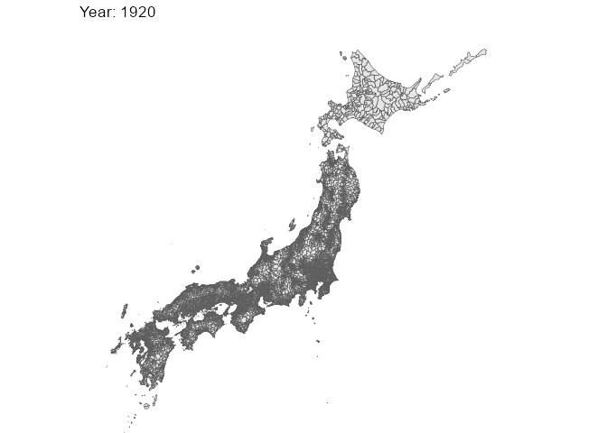

<!-- README.md is generated from README.Rmd. Please edit that file -->

# jpadminbdry

<!-- badges: start -->
<!-- badges: end -->

The goal of jpadminbdry is to …

## Installation

You can install the development version of jpadminbdry from
[GitHub](https://github.com/) with:

``` r
# install.packages("devtools")
devtools::install_github("UchidaMizuki/jpadminbdry")
```

## Example

This is a basic example which shows you how to solve a common problem:

``` r
library(jpadminbdry)
library(tidyverse)
```

What is special about using `README.Rmd` instead of just `README.md`?
You can include R chunks like so:

``` r
theme_set(theme_void())

for (year in seq(1920, 2010, 30)) {
  plot <- admin_boundary(year) |> 
    ggplot() +
    geom_sf() +
    coord_sf(xlim = c(128, 150),
             ylim = c(30, 46)) +
    labs(title = str_glue("Year: {year}"))
  print(plot)
}
```


